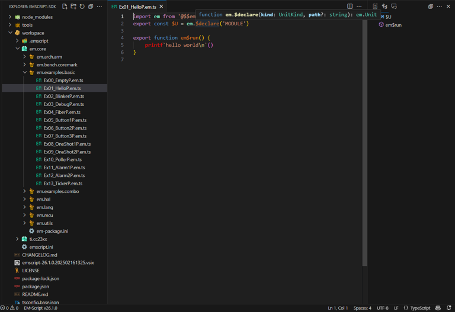
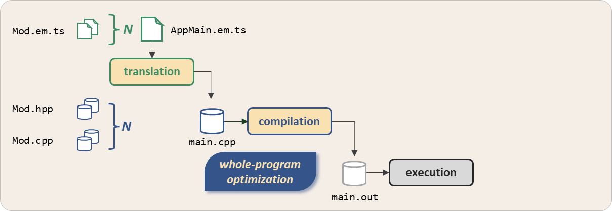
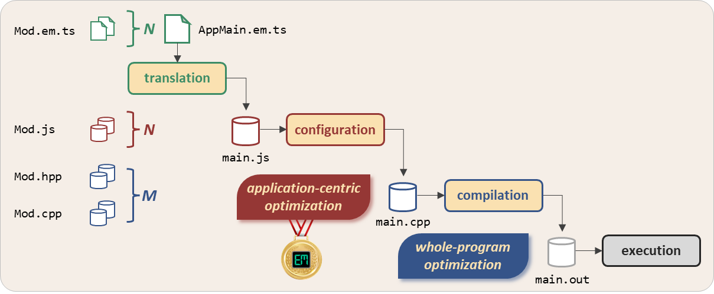

# EM&bull;Script &mdash; EM&#8482; Reimagined 

<style>.md-typeset h2 {margin-bottom: 1.5em !important;}</style>

Welcome (back) to **EM** [_ˈɛm_&thinsp;] &ndash; a programming environment which targets resource-constrained embedded systems.&thinsp; To flatten its learning curve and drive broader use, we've now reimagined EM within the boundaries of the TypeScript language &ndash; leading us to **EM&bull;Script**.

<!-- imagemapper.noc.io -->


<div style="margin-bottom: -15px">
<svg version="1.1" xmlns="http://www.w3.org/2000/svg" xmlns:xlink="http://www.w3.org/1999/xlink" viewBox="0 0 1262 675">
  <image width="1262" height="675" xlink:href="assets/splash.png"></image>
  <a xlink:href="https://www.linkedin.com/company/the-em-foundation/about/?viewAsMember=true" target="_blank">
    <rect x="1070" y="499" fill="#fff" opacity="0" width="58" height="74"></rect>
  </a><a xlink:href="https://github.com/em-foundation" target="_blank">
    <rect x="1150" y="499" fill="#fff" opacity="0" width="67" height="74"></rect>
  </a>
</svg>
</div>

## What and why

!!! question "1 &mdash; Refresh my memory of EM&thinsp;..."

Since its inception in 2010, the focus of the [EM Programming Language](https://docs.openem.org/) has remained constant &ndash; producing "tiny code for tiny chips" where every byte of memory and &mu;Joule of energy matters when deploying low-cost, low-power embedded systems.

Having supported more than twenty 8/16/32-bit MCUs from a dozen silicon vendors, the EM language promises a _higher-level_&thinsp; programming paradigm coupled with a _higher-level_&thinsp; of runtime performance when compared with legacy C/C++ code targeting these MCUs.

As important, just a handful of EM programmers have developed thousands of EM modules re-used across a broad range of high-volume (yet proprietary) IoT applications.&thinsp;  In late 2023, [The EM Foundation](https://www.linkedin.com/company/the-em-foundation/?viewAsMember=true) &ndash; a 501(c)(3) non-profit &ndash; announced an openly available **EM-SDK**. 

!!! question "2 &mdash; So why did you create **EM&bull;Script**"

Promoting the EM SDK through [blog posts](https://blog.openem.org/) in early 2024 elicited a mixed bag of reactions &ndash; from _"cool, good luck"_&thinsp; to _"sorry, try again"_&thinsp;.&thinsp;  Despite evidence quantifying EM's performance advantage over C/C++, a new (and unknown&thinsp;!!) language does raise the acceptance bar.

Needless to say, the effort required to support a handful of developers pales in comparison to promoting, sustaining, and evolving an open-source EM language for the broad community of embedded programmers.&thinsp; This realization then led to a radical change of course.

**Zig&bull;EM** &ndash; announced [here](https://blog.zigem.tech/post-001/) in 3Q24 &ndash; attacked the issue head-on by nominally grafting the novel concepts and constructs of EM onto _another_&thinsp; programming language.&thinsp;

!!! zig "A hidden gem"
    First released in early 2016, [Zig](https://ziglang.org/) also offers a "higher-level programming with higher-levels of performance" value proposition when compared with C/C++.&thinsp; Zig regularly earns high-marks when held up against other modern system programming languages like Go and Rust &ndash; both already targeting embedded MCUs.

    But unlike the competition, Zig offers an inherent simplicity and transparency reminiscent of classic C &ndash; the incumbant system programming language which some argue Zig could supplant.&thinsp; At the same time, Zig challenges many entrenched programming practices and demands that we "think differently" from the outset.

    Speaking now from personal experience:&ensp;  While not the easiest language to master, the [Ziggit forum](https://ziggit.dev/) stands apart for how it welcomes, nutures, and encourages new members of the Zig programming community.

Compared with other system programming languages, however, Zig very much remains a work in progress:&ensp; a stable 1.0 release still lies years away; and language server support within popular development environments like **VS Code** remains skeletal.

Some lessons learned from the **Zig&bull;EM** experience:

<div markdown class="em-small">

{[sp,em-color-orange]&#x25CF;&ensp;} embedding EM within another programming language can afford re-use of the latter's infrastructure

{[sp,em-color-orange]&#x25CF;&ensp;} a language combo need not compromise runtime performance [time, space, power] versus legacy EM

{[sp,em-color-orange]&#x25CF;&ensp;} while code performance remains a top priority, the _quality_&thinsp; of the coding experience can't lag far behind

</div>

which then brings us then to **EM&bull;Script** &ndash; same approach, different language&thinsp;....

!!! question "3 &mdash; What makes TypeScript an ideal host"

[TypeScript](https://www.typescriptlang.org/) &ndash; younger than EM, in fact &ndash; now claims a perennial spot amongst the five most widely used programming languages.(1) The language also enjoys first-class support within **VS Code** &ndash; an environment written in TypeScript and used by a vast majority of developers.
{ .annotate }

1. see the [Stack Overflow Developer Survey](https://survey.stackoverflow.co/2024/)

**EM&bull;Script** does in fact leverage many of the language services and compiler APIs delivered as part of TypeScript.&thinsp; As important, the later's robust type-system enables us to capture "the essence of EM" without leaving the confines of the TypeScript language.

But perhaps the strongest reason for choosing TypeScript comes down to this insight:

!!! bulb "&ast;NOBODY&ast; regards TypeScript as a suitable language for programming resource-constrained MCUs&thinsp;!!"

Opportunities abound.... Unlike other modern programming languages that have "branched out" to target embedded MCUs [MicroPython, TinyGo, and others], TypeScript has never had a bridge into the domain of low-cost, low-power embedded systems &ndash; until now, of course&thinsp;!!

## Show and tell

!!! question "4 &mdash; Show me some **EM&bull;Script** source code"

Well, you can't call yourself a programming language if you can't do this:&ensp; :wave: :earth_americas:

<span markdown id="ex1"></span>

```ems linenums="1" title="em.examples.basic/Ex01_HelloP"
import em from '@$$emscript'
export const $U = em.$declare('MODULE')

export function em$run() {
    printf`hello world\n`()
}
```

And to dispel any doubts, let's view the corresponding&thinsp;{[fn].em.ts} source file inside **VS Code** using our special **EM&bull;Script** extension &ndash; which will flatten your learning curve by using core Type&shy;Script language services such as syntax highlighting, hover help, and intellisense.

<figure markdown id="fig1">

<figcaption>VS Code Workspace 
</figure>

For a more realistic and compelling example, consider this "low-level" **EM&bull;Script** module which implements a bit-banged UART transmitter using a GPIO pin and a hardware counter:

```ems linenums="1" title="em.utils/SoftUart"
import em from '@$$emscript'
export const $U = em.$declare('MODULE')

import * as Common#u from '@em.mcu/Common.em'
import * as GpioI#u from '@em.hal/GpioI.em'

export const baud_rate = $config<u32>(9_600)
export const TxPin = $proxy<GpioI#u.$I>()

const bit_time = $config<u16>()

export namespace em$meta {
    export function em$construct() {
        bit_time.$$ = Math.floor(1_000_000 / baud_rate.$$)
    }
}

export function em$startup(): void {
    TxPin.$$.makeOutput#f()
    TxPin.$$.set#f()
}

export function put#f(data: u8): void {
    const bit_cnt = 10
    var tx_byte: u16 = (data << 1) | 0x600
    const key = Common#u.GlobalInterrupts.$$.disable#f()
    for (let i = 0; i < bit_cnt; i++) {
        Common#u.UsCounter.$$.set#f(bit_time.$$)
        if (tx_byte & 0x1) {
            TxPin.$$.set#f()
        } else {
            TxPin.$$.clear#f()
        }
        tx_byte >>= 1
        Common#u.UsCounter.$$.spin#f()
    }
    TxPin.$$.set#f()
    Common#u.GlobalInterrupts.$$.restore#f(key)
}

```
While this module clearly interacts with typical MCU hardware &ndash; controlling interrupts, toggling pins, awaiting &mu;s counters &ndash; the&thinsp;{[fn]em.utils/SoftUart}&thinsp;code shown here in fact remains _100% portable_&thinsp; across any MCU offering these sorts of hardware capabilities.

!!! question "5 &mdash; How does **EM&bull;Script** optimize target firmware"

While sourced as TypeScript, an efficient implementation of the {[cf]put} function defined at line {[lr,1,23]} of {[fn]em.utils/SoftUart} ultimately requires _object code_&thinsp; targeting the MCU instruction-set.&thinsp; To that end, **EM&bull;Script** could simply translate {[fn].em.ts} files into corresponding C++ sources.

<figure markdown id="fig2">

<figcaption>Compilation Phase 
</figure>

!!! info "Bear with us &ndash; we've purposely omitted the most critical phase of the **EM&bull;Script** program build-flow&thinsp;!!"

Starting with a "top-level" program source file (eg, {[fn]Ex01_HelloP.em.ts}), the translator follows its {[ck]import} chain and generates a {[fn]main.cpp} program &ndash; adding other translated files through {[ck]#include} directives and implementing the special {[cb]em$run} function seen [here](#ex1) within {[cf]main}.

Like EM before it, the **EM&bull;Script** build flow can leverage any compiler suite which supports the **C++14** standard.&thinsp; And who knows, maybe **EM&bull;Script** will someday support other target programming languages as well &ndash; including **Zig**. :wink:

With a self-contained {[fn]main.cpp} as its sole input, the downstream compiler can aggressively apply stock optimization techniques(1)&thinsp;to the _whole program_&thinsp; &ndash; yielding a smaller, more efficient {[fn]main.out} image.&thinsp; But the real power of **EM&bull;Script** lies in what happens upstream:
{ .annotate }

1. constant folding, function inlining, dead-code elimination, etc

<figure markdown id="fig3">

<figcaption>Configuration Phase 
</figure>

The **EM&bull;Script** program build-flow inserts a novel _configuration_&thinsp; step between initial translation and downstream compilation &ndash; enabling a world of application-centric optimizations often missed when building legacy C/C++ programs.

Besides generating C++ code for each {[fn].em.ts} source file, **EM&bull;Script** invokes an extended **TypeScript&rarr;JavaScript** transpiler which yields corresponding {[fn].em.js} modules &ndash; all combined into a single {[fn]main.js} program executed at _build-time_&thinsp; on your host PC.

Our configuration phase in fact serves as a _staging area_&thinsp; where the whole program comes together for a "dry-run", so to speak.&thinsp; By implementing special  functions(1)inside {[ck]namespace}&thinsp;{[es,nc]em$meta}, each module can actively participate in the configuration process at build-time:
{ .annotate }

1. {[cb]em$configure}, {[cb]em$construct}, {[cb]em$generate}, etc

<div markdown class="em-small">

{[sp,em-color-teal]&#x25CF;&ensp;} by binding values to **EM&bull;Script** {[cb]$config} parameters published by other modules

{[sp,em-color-teal]&#x25CF;&ensp;} by pre-initializing static constants and variables used internally by the module

{[sp,em-color-teal]&#x25CF;&ensp;} by wiring one module to another via the {[cb]$proxy}&thinsp;&ndash;&thinsp;{[cb]$delegate} design pattern

{[sp,em-color-teal]&#x25CF;&ensp;} by forcibly including&thinsp;/&thinsp;excluding individual modules from downstream compilation

{[sp,em-color-teal]&#x25CF;&ensp;} by generating fragments of specialized C/C++ code which {[fn]main.cpp} will incorporate

</div>

!!! bulb "As such, **EM&bull;Script** serves as its own _meta-language_&thinsp; used for build-time _meta-programming_&thinsp;."

With boundless resources on your host PC &ndash; and with all of **Node.js** available to the {[fn]main.js} meta-program &ndash; opportunities abound for individual modules to encapsulate application-centric logic that ultimately shapes program images targeting resource-constrained MCUs.

## Next steps

!!! question "6 &mdash; Can I start exploring the **EM&bull;Script** environment"

Absolutely &ndash; the [Setup](setup/index.md){ .em-line } section of this site will help you get started with our **EM&bull;Script SDK**.&thinsp; Once you've provisioned a compatible(1)host PC, you can cross-compile target applications using **EM&bull;Script** &ndash; either from the command-line or else within the **VS Code** environment.
{ .annotate }

1. **Windows**, **Linux**, or **MacOS**

While not required, we strongly encourage you to purchase a low-cost MCU development board currently supported by the **SDK**.&thinsp;  Nothing beats the joy of blinking those LEDs&thinsp;!!&thinsp; :joy:

If you'd prefer to just "look around", check out the other sections of this site &ndash; which we'll continue to populate going forward.&thinsp; You can also browse the set of target [Packages](shelf/index.md) delivered with the latest **EM&bull;Script SDK**.&thinsp; And for those wanting OSS, endulge yourself at [GitHub](https://github.com/em-foundation).

!!! question "7 &mdash; Tell me more about the longer-term roadmap for **EM&bull;Script**"

After a one-year detour &ndash; which led us to **EM&bull;Script** via **Zig&bull;EM** &ndash; we can finally continue down the path originally charted by the EM programming language:

<div markdown class="em-ul em-ul-check">

support a broad(er) range of embedded MCUs and document how to create an {[cb]em$distro}

offer lightweight connectivity frameworks built upon standard&thinsp;/&thinsp;proprietary wireless protocols

explore the impact of 10&thinsp;X code-size reductions on novel MCU architectures based on **RISC-V**

showcase **EM&bull;Script** through application development projects sponsored by **The EM Foundation**

</div>

**EM&bull;Script** &ndash; {[sp,em-color-logo]The embedded language for embedded programming}

{[hc]}
