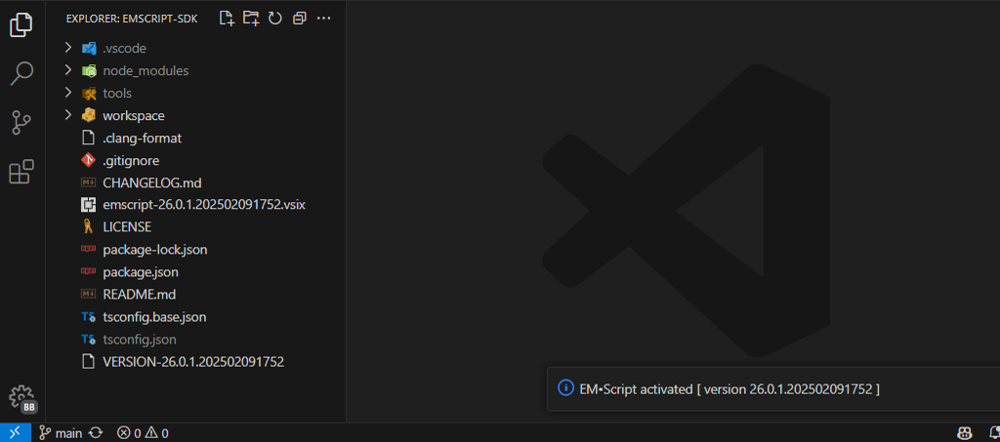
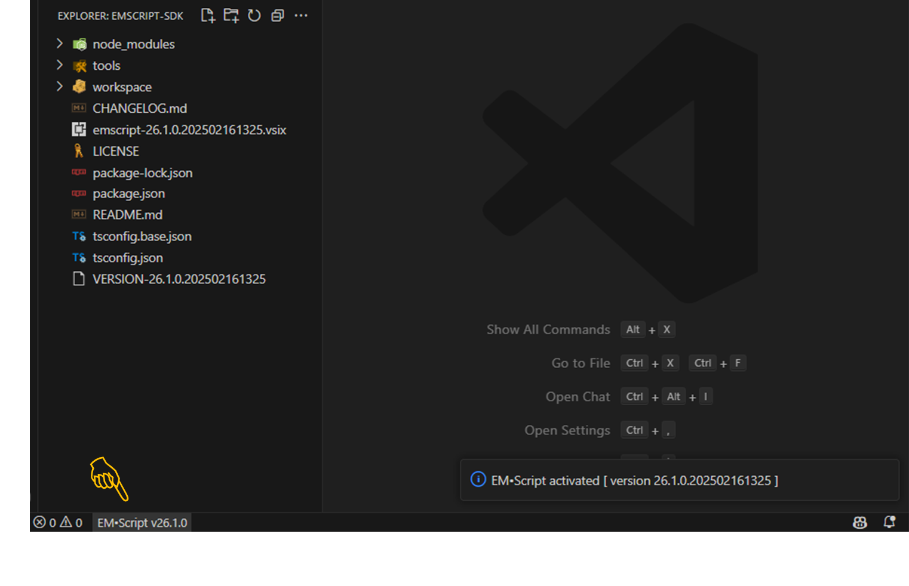
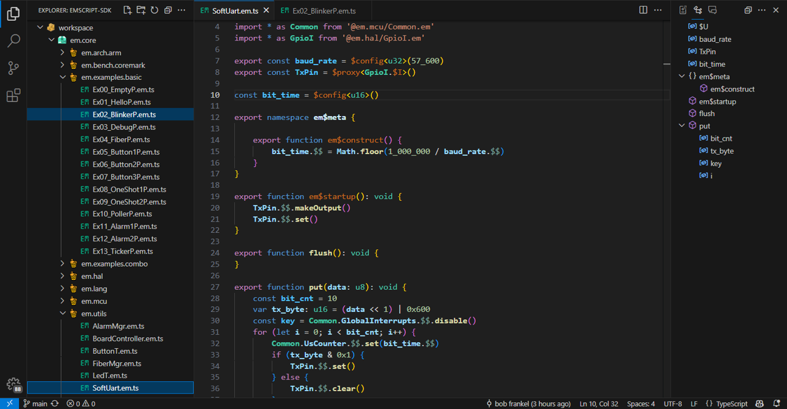

# Getting started with EM&bull;Script

**EM&bull;Script** requires a cross-development environment comprising _hosted_&thinsp; software tools will compile and load executable programs onto _target_&thinsp; MCU hardware.&thinsp; For the host, you'll use a PC running **Windows**, **Linux**, or **MacOS**; for the target, you can choose any MCU board for which a corresponding {[cb]em$distro} support package already exists.

Before turning to the **EM&bull;Script SDK** (described next), you should first install or upgrade the following tooling environments on your host PC:

|  |  |  |
|:-|:-|:-|
|[Node.js](https://nodejs.org/en/download)|version 18.0.0 or later| execute {[sh]node}&thinsp;{[sh]--version} to verify |
|[VS Code](https://code.visualstudio.com/download)|version 1.90.0 or later| execute {[sh]code}&thinsp;{[sh]--version} to verify |

=== "Windows"

    If you don't already have a recent version of the **Git Bash** shell, you should also install [Git for Windows](https://gitforwindows.org/).&nbsp;  To verify your setup, ensure that the {[sh]node} and {[sh]code} commands from the previous table operate correctly under **Git Bash**. 

!!! warning "Do _not_ proceed forward if these verification checks should fail&thinsp;!!!"

## Software development kit

You can provision the latest **EM&bull;Script SDK** onto your host PC in three simple steps:

{[bx,1]} &nbsp; download a workspace pre-populated with packages of **EM&bull;Script** target-content 
{[bx,2]} &nbsp; install **EM&bull;Script** host-tooling along with some 3rd party compilers and loaders 
{[bx,3]} &nbsp; verify that you can build (and optionally run) a sample **EM&bull;Script** program

Step {[bx,1]} relies upon the {[sh]git} command to initially populate (and subsequently update) a special {[fn]emscript-sdk} folder on your host PC:

<pre><code>{[sp,em-color-blue][~]}
$ {[sp,em-color-orange]git clone https://github.com/em-foundation/emscript-sdk.git}
$ {[sp,em-color-orange]cd emscript-sdk}
{[sp,em-color-blue][~/emscript-sdk]}
$ &#x25AE</code></pre>

In general, you can maintain multiple {[fn]emscript-sdk} installations located anywhere on your PC &ndash; though we recommend starting with your {[sh]$HOME} folder <code>{[sp,em-color-blue][~]}</code> as illustrated above.&thinsp;  Once inside {[fn]~/emscript-sdk}, you can use other {[sh]git} sub-commands to upgrade your **EM&bull;Script** installation [{[sh]git}&thinsp;{[sh]pull}] as well as switch to particular tagged releases [{[sh]git}&thinsp;{[sh]checkout}&thinsp;{[sh]v26.1.0}].

Step {[bx,2]} uses the **Node Package Manager** {[sh]npm} command to install tooling artifacts into your current {[fn]emscript-sdk} folder:

<pre><code>{[sp,em-color-blue][~/emscript-sdk]}
$ {[sp,em-color-orange]npm clean-install}</code></pre>

Initial execution of this command will create the special {[fn]node_modules} sub-folder used by **Node.js** as well as a {[fn]tools} sub-folder used by **EM&bull;Script**.&thinsp; Use the {[sh]npm}&thinsp;{[sh]list} command to show the current set of installed packages, which should track the dependencies called out within the top-level {[fn]emscript-sdk/package.json} file.

Step {[bx,3]} finally verifies your **EM&bull;Script** installation by building a small program: 

<pre><code>{[sp,em-color-blue][~/emscript-sdk]}
$ {[sp,em-color-orange]npm run verify-build} 
&gt; emscript-cli@26.0.1 verify-build
&gt; sh -c '(cd workspace; npx emscript-cli build --unit em.core/em.examples.basic/Ex02_BlinkerP.em.ts)'
building ‘em.examples.basic/Ex02_BlinkerP’ ...
    using setup ‘ti.cc23xx://default’ with board ‘LP_EM_CC2340R5’
    executed ‘em$meta’ program, generated ‘main.cpp’ using [31/62] units in 0.90 seconds
compiling ‘main.cpp’ ...
    image sha32: 1dc95979
    image size: text (1212) + const (12) + data (0) + bss (16)
done in 1.80 seconds 
{[sp,em-color-blue][~/emscript-sdk]}
$ &#x25AE</code></pre>

## Target MCU hardware

The **SDK** contains all tooling needed to compile and load **EM&bull;Script** programs targeting different MCU development boards.&thinsp;  While we encourage you to purchase one of these boards, you can still learn about **EM&bull;Script** by building (but not running) some sample programs.

=== "LP-EM-CC2340R5"

    The Texas Instruments [CC2340R5](https://www.ti.com/product/CC2340R5) wireless MCU features an Arm Cortex-M0+ CPU together with a familiar suite of peripherals &ndash; including a generic 2.4&thinsp;GHz radio with BLE 5.x support.  Texas Instruments also offers an inexpensive [LP-EM-CC2340R5](https://www.ti.com/tool/LP-EM-CC2340R5) evaluation board in their familiar **LaunchPad** format &ndash; available from TI as well as their distributors.

    You should also purchase this [emulator board](https://www.ti.com/tool/LP-XDS110ET) from TI &ndash; unless you already own a "classic" TI LaunchPad with on-board XDS110 support.  In that case, you can easily connect a legacy LP to your new LP-EM-CC2340R5 board using a cable supplied by TI.&thinsp;  If you haven't used an XDS110 before, run the {[fn]emscript-sdk/tools/ti-uniflash/one_time_setup} script.

    We'll soon verify that your LP-EM-CC2340R5 hardware works in concert with the **SDK** by building and loading a sample **EM&bull;Script** program.
    
## VS Code extension

To flatten your learning curve, we strongly encourage use of our **EM&bull;Script Extension**, which you can install from the command-line prior to launching **VS Code**:

<pre><code>{[sp,em-color-blue][~/emscript-sdk]}
$ {[sp,em-color-orange]code --install-extension emscript*.vsix} Installing extensions...
Extension ‘emscript-26.0.1.202502091752.vsix’ was successfully installed. 
{[sp,em-color-blue][~/emscript-sdk]}
$ {[sp,em-color-orange]code .}</code></pre>

If all goes well, you should see a top-level listing of the {[fn]~/emscript-sdk} folder together with a short notification that the **EM&bull;Script Extension** has activated.

<figure markdown id="fig1">

<figcaption>Launching VS Code
</figure>

You can learn more by navigating to the **EXTENSIONS > INSTALLED** side-panel or else by visiting the **EM&bull;Script** page at the [VS Code Marketplace](https://marketplace.visualstudio.com/items?itemName=the-em-foundation.emscript).

<figure markdown id="fig2">

<figcaption>Installed Extensions
</figure>

From here, you should drill-down into the {[fn]~/emscript-sdk/workspace} sub-folder and explore the software content which **EM&bull;Script** can build and load onto your target MCU hardware.

<figure markdown id="fig3">

<figcaption>Target Content
</figure>

<!--
Our **Zig&bull;EM** extension supports features already familiar to VS Code users &ndash; syntax highlighting, code navigation, outline views, hover help, intellisense completion, and many more.
-->

## Command line

The **SDK** contains an {[sh]emscript} command-line tool which compiles and loads programs for your target MCU hardware.&thinsp; Used internally by {[sh]npm}&thinsp;{[sh]run}&thinsp;{[sh]verify-build} as part of installation step {[bx,3]}, you can access the {[sh]emscript} command directly from your PC's shell.

You'll find the {[sh]emscript} executable at {[fn]emscript-sdk/node_modules/.bin/emscript};&thinsp; for convenience, amend your shell's {[sh]$PATH} or else reference {[sh]emscript} with a named link or alias:

<pre><code>$ {[sp,em-color-orange]alias emscript='~/emscript-sdk/node_modules/.bin/emscript'}
$ {[sp,em-color-orange]emscript --version}
26.0.1.202502071929</code></pre>

The {[sh]emscript}&thinsp;{[sh]build} sub-command will serve as your primary entry-point when working with **EM&bull;Script**.&thinsp; Typically invoked inside the {[fn]emscript-sdk/workspace} sub-folder, let's now build the _same_&thinsp; target program used to verify SDK installation:

<pre><code>{[sp,em-color-blue][~/emscript-sdk/workspace]}
{[sp, em-color-orange]emscript build --unit em.core/em.examples.basic/Ex02_BlinkerP.em.ts}
building ‘em.examples.basic/Ex02_BlinkerP’ ...
    using setup ‘ti.cc23xx://default’ with board ‘LP_EM_CC2340R5’
    executed ‘em$meta’ program, generated ‘main.cpp’ using [31/62] units in 0.90 seconds
compiling ‘main.cpp’ ...
    image sha32: 1dc95979
    image size: text (1212) + const (12) + data (0) + bss (16)
done in 1.80 seconds</code></pre>

To confirm operation of your target MCU hardware, simply append the {[sh]--load} option to the same command:

<pre><code>{[sp,em-color-blue][~/emscript-sdk/workspace]}
{[sp, em-color-orange]emscript build --unit em.core/em.examples.basic/Ex02_BlinkerP.em.ts --load}
building ‘em.examples.basic/Ex02_BlinkerP’ ...
    ...
done in 1.80 seconds
loading ‘em.examples.basic/Ex02_BlinkerP’ ...
done</code></pre>

If you now see an on-board (green) LED blink five times, go out and celebrate.... :beers:

{[hc]}

